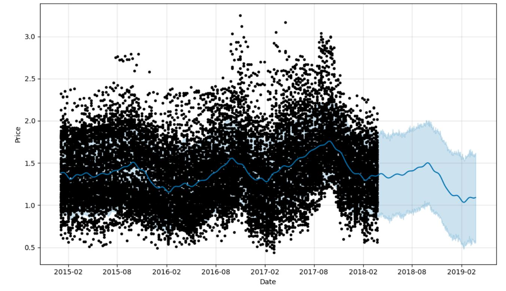
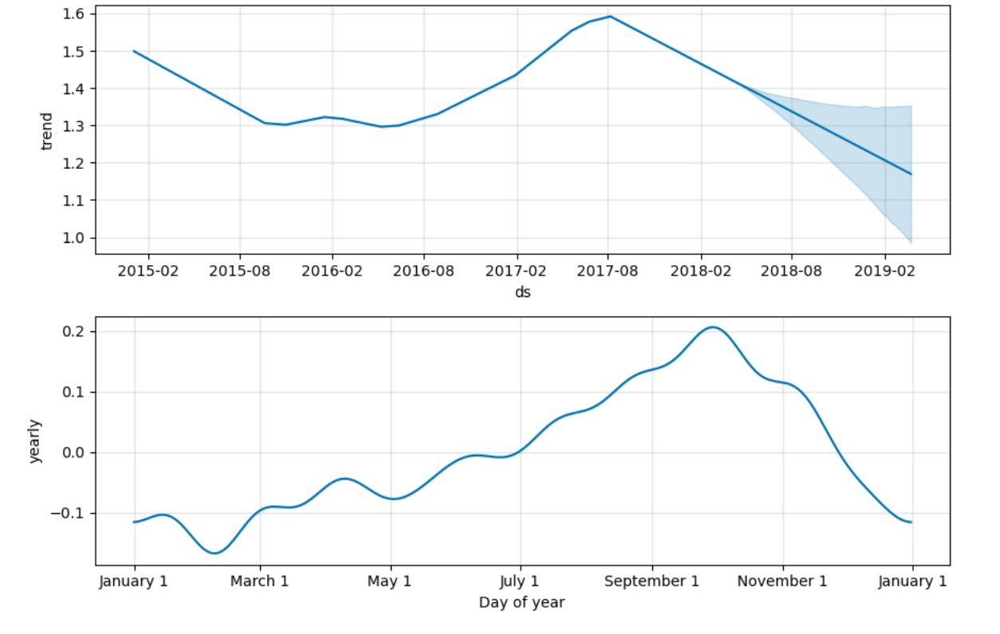
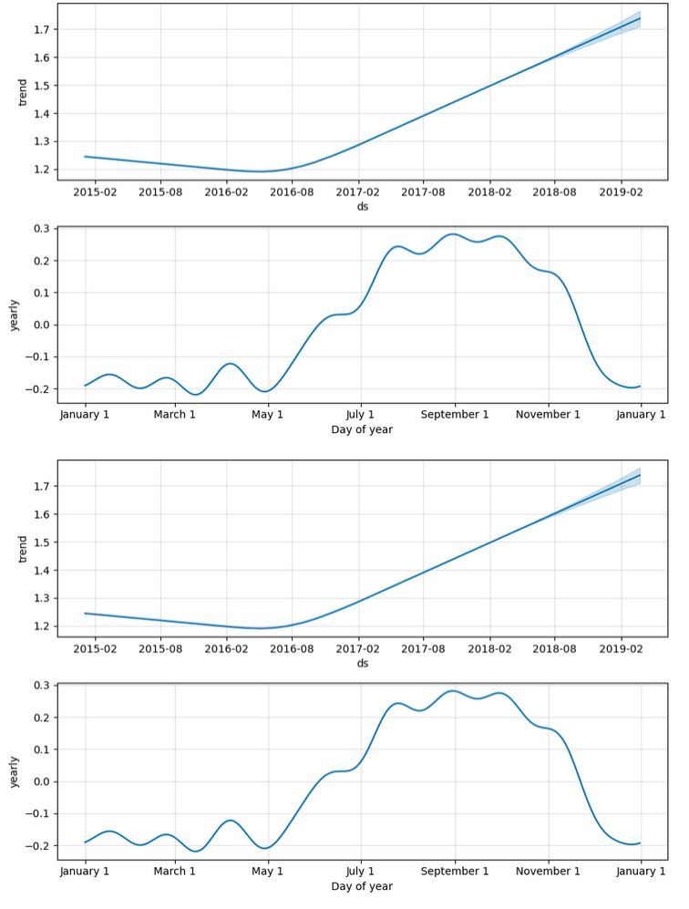

# Avocado Price Forecasting with Facebook Prophet

This project harnesses the power of the Facebook Prophet library to predict avocado prices in various cities across the USA. Using a dataset sourced from Kaggle, 
this repository delves into time series analysis to uncover trends and make future price forecasts. The data is skillfully visualized on both a monthly and yearly basis, delivering valuable insights into avocado prices spanning from 2015 to 2018.
You can download the data from [here](https://www.kaggle.com/datasets/neuromusic/avocado-prices)  

The Price Pattern in Western States of the USA:

