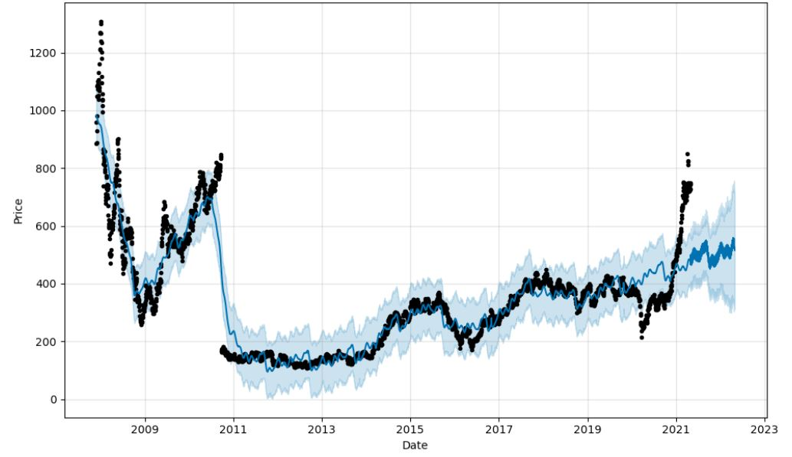
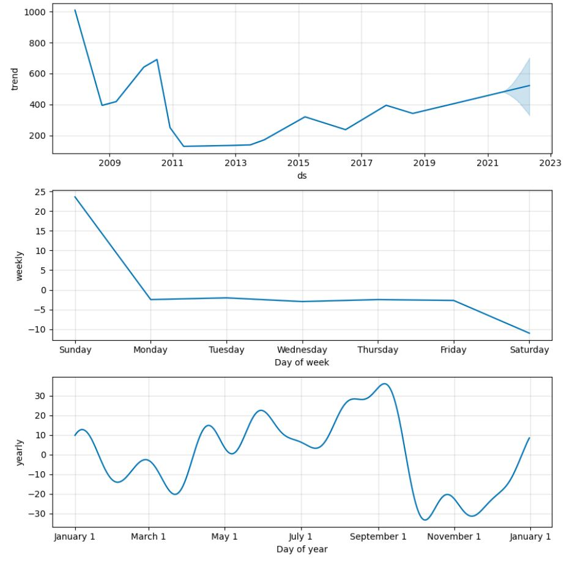

# Stock Market Prediction for Adani Port with Facebook Prophet

This project leverages the capabilities of the Facebook Prophet library to forecast stock market trends for Adani Ports in India. Drawing data from a Kaggle dataset, 
this repository delves into comprehensive time series analysis, shedding light on the stock's historical performance and future predictions. 
The visualizations, offered on weekly, monthly and yearly scales, provide valuable insights into Adani Port's stock trends, spanning from 2007 to 2022. Uncover the patterns and make informed decisions in the world of stock trading with this repository. 

